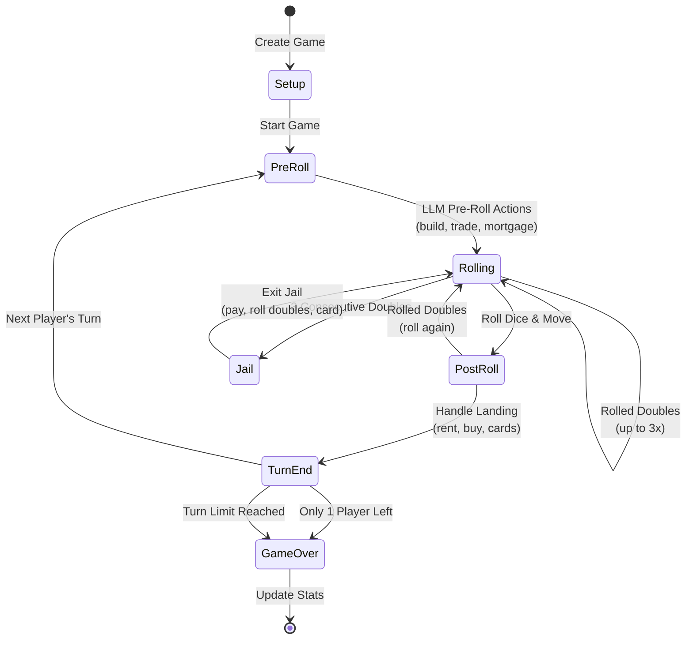
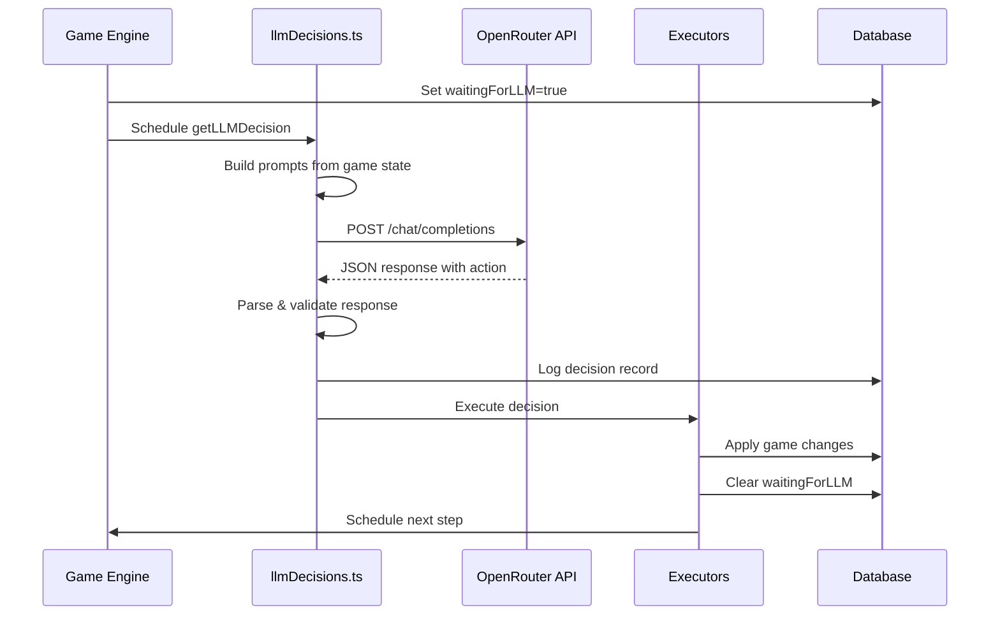
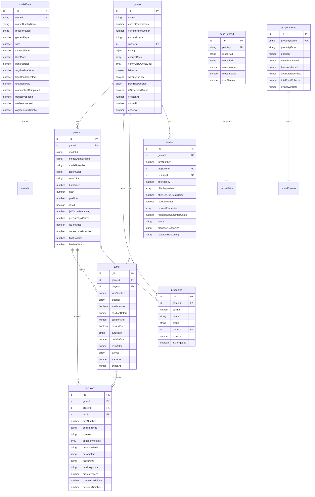
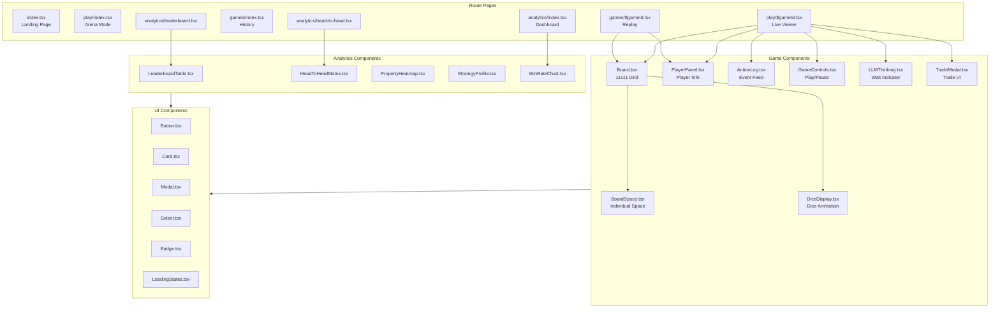
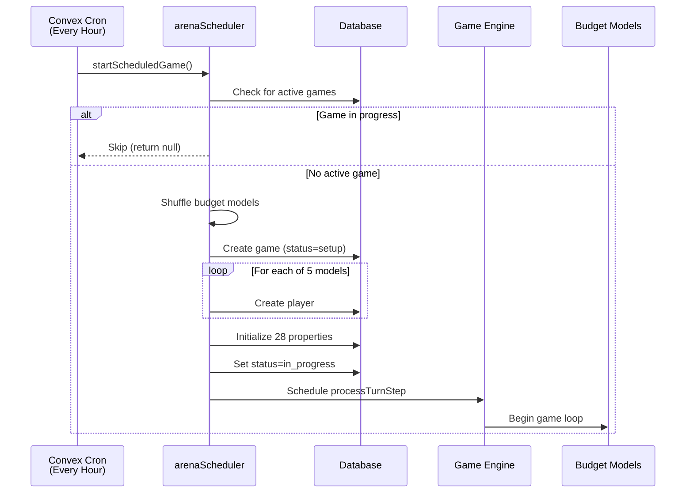
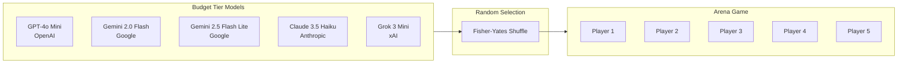
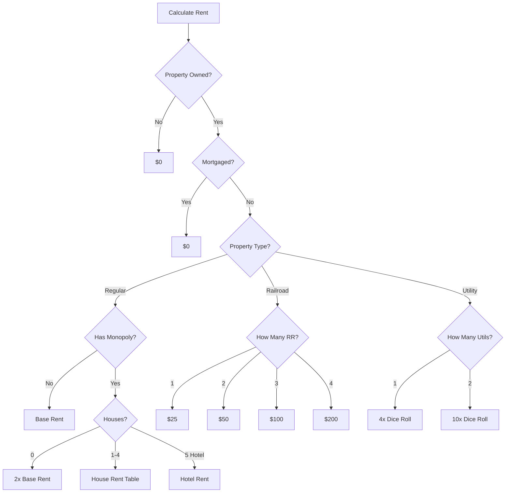
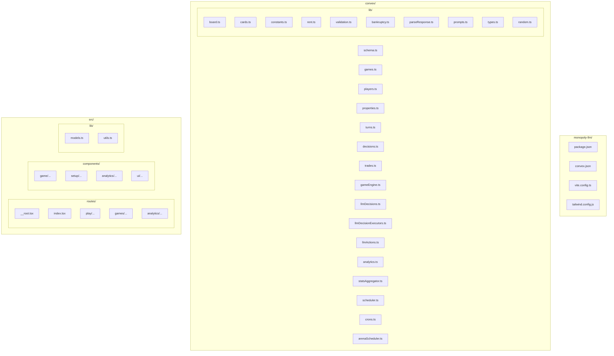

# LLM Monopoly Arena - Architecture Diagrams

This document contains Mermaid diagrams showing how all components work together

## System Overview

```mermaid
flowchart TB
    subgraph Frontend["Frontend (TanStack Start)"]
        Home["/index.tsx<br/>Home Page"]
        Arena["/play/index.tsx<br/>Arena Mode"]
        LiveGame["/play/$gameId.tsx<br/>Live Game Viewer"]
        History["/games/index.tsx<br/>Game History"]
        Replay["/games/$gameId.tsx<br/>Game Replay"]
        Analytics["/analytics/*<br/>Leaderboard & Stats"]
    end

    subgraph Convex["Convex Backend"]
        subgraph Queries["Queries (Read-only)"]
            GamesQ["games.ts<br/>list, get, getFullState"]
            PlayersQ["players.ts<br/>getByGame, getCurrent"]
            PropsQ["properties.ts<br/>getByGame, getByOwner"]
            TurnsQ["turns.ts<br/>getByGame, getLatest"]
            DecisionsQ["decisions.ts<br/>getByGame, getByPlayer"]
            AnalyticsQ["analytics.ts<br/>getLeaderboard, getHeadToHead"]
        end

        subgraph Mutations["Internal Mutations"]
            GameEngine["gameEngine.ts<br/>startGame, processTurnStep"]
            Executors["llmDecisionExecutors.ts<br/>Execute LLM choices"]
            StatsAgg["statsAggregator.ts<br/>Update analytics"]
        end

        subgraph Actions["Actions (External API)"]
            LLMDecisions["llmDecisions.ts<br/>getLLMDecision"]
        end

        subgraph Cron["Scheduled Jobs"]
            CronJob["crons.ts<br/>Hourly arena game"]
            ArenaScheduler["arenaScheduler.ts<br/>startScheduledGame"]
        end

        subgraph Lib["Pure Logic Libraries"]
            Board["board.ts<br/>Space info, positions"]
            Rent["rent.ts<br/>Rent calculation"]
            Cards["cards.ts<br/>Chance/CC execution"]
            Validation["validation.ts<br/>Action validation"]
            Bankruptcy["bankruptcy.ts<br/>Asset liquidation"]
            Prompts["prompts.ts<br/>LLM prompt building"]
        end

        DB[(Convex Database)]
    end

    subgraph External["External Services"]
        OpenRouter["OpenRouter API<br/>Claude, GPT, Gemini, Grok"]
    end

    %% Frontend to Convex
    Home --> GamesQ
    Arena --> ArenaScheduler
    LiveGame --> GamesQ
    LiveGame --> PlayersQ
    LiveGame --> PropsQ
    LiveGame --> TurnsQ
    History --> GamesQ
    Replay --> TurnsQ
    Replay --> DecisionsQ
    Analytics --> AnalyticsQ

    %% Convex internal flow
    CronJob -->|every hour| ArenaScheduler
    ArenaScheduler --> GameEngine
    GameEngine --> LLMDecisions
    LLMDecisions --> OpenRouter
    LLMDecisions --> Executors
    Executors --> GameEngine
    GameEngine --> StatsAgg

    %% Database connections
    Queries --> DB
    Mutations --> DB
    Actions --> Mutations

    %% Lib usage
    GameEngine --> Lib
    Executors --> Lib
    LLMDecisions --> Prompts
```

## Game Turn Flow

## LLM Decision Flow

## Database Schema

## Component Architecture

## Arena Mode Scheduling

## Budget Models

## Rent Calculation Logic

## File Structure

